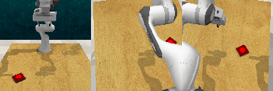

# IGA-RLBench
This project investigates the deployment and performance of Implicit Graph Alignment (IGA) on RLBench tasks, building upon prior work from [IGA](https://github.com/vv19/iga) and [Instant Policy](https://github.com/vv19/instant_policy). For research and study purposes only.

## Setup

**Clone this repo**

```
git clone https://github.com/zxhhai/IGA-RLBench.git
cd iga/iga
```

**Create conda environment**

```
conda env create -f environment.yml
conda activate iga_env
pip install -e .
pip install pyg-lib -f https://data.pyg.org/whl/torch-2.2.0+cu118.html
```

For simulation deployment, install RLbench by following the instructions in https://github.com/stepjam/RLBench.


## Evaluation
Evaluate IGA on 17 different tasks.
```bash
./evaluate.sh
```

## Successful Cases



## Failure Cases


## Acknowledgements
We would like to express our sincere gratitude to the authors of the following open-source projects, whose pioneering work laid the foundation for this study:

1. IGA[https://github.com/vv19/iga]: For the original method design and implementation of Implicit Graph Alignment.

2. Instant Policy[https://github.com/vv19/instant_policy]: For providing the simulation framework.